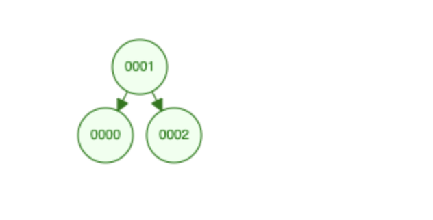

# **Motivation**

Most programming languages have pre-defined search algorithms; leveraging them allows for efficient software development 
and peace of mind (as most of them have been thoroughly tested for reliability and compatibility). 
Sometimes, however, they are not suited for some custom-made API's, 
so I figured playing around designing a search algorithm of my own would be a cool enterprise. 

Let the tree above serve as storage for a state's license plates, 
so that we can query the tree to locate specific plate numbers; 
we would traverse the plates in the tree, and compare each plate's number to the number we're looking for.
Upon successfully locating the desired number, we would stop our search; otherwise, we would continue our search, until
the desired value was found, or we'd reached the end of the tree. 

Assumption: Our tree does not allow for duplicate values; no two cars exist with the same plate number, after all. 

## **Designing the Algorithm**

To effectively search our tree, we must ensure that it *exists*. From an every-day point of view, the previous
statement does not make sense--searching a tree implies that it exists. Since we are dealing with memory,however, 
a tree is typically represented by a variable, and this variable interfaces between our program and the tree's contents.

Let myTree be our tree variable; the following piece of code comes to mind: **if myTree != null**. 
Depending on whether we are querying the first element of our tree or any of its descendants, 
a query might be of type **myTree.head == searchVal** or **myTree.descendant == searchVal**. 
More generally, though, a query would be of type **myTree.element == searchVal**.

At any level of a non-empty tree, we usually have 04 types of representations: a single tree element (also called node); 
an element with left descendant; an element with right descendant; an element with both right and left descendants.
We must take these representations in consideration when designing our algorithm, thus leading us to the following
pseudocode: 

  
Code example

  

    ...
  

    - Is tree's variable null? 
      - If yes, stop search
      - If no, query the tree's head node 
        - Is head's value == desired value? 
          - If yes, stop search 
          - If no, check for children nodes
          - Check all descendants until desired value is found or end of tree is reached
    - Return value indicating that search was successful or unsuccessful 

## **Taking in Account the Data Structure's Specifics**

Earlier, we assumed our tree did not allow for duplicates, and doing so allowed us some leeway in how we proceeded.
This is not the case all the time, as some tree API's allow for duplicate values. Another thing we must consider is 
how our values (license plate numbers) are stored internally: are they stored in ascending order, descending order, or
sequentially? This would arguably have the greatest impact in what we do next. 

If the values are stored in ascending order, we could implement bits of our search as follows: 

    if(myTree.node.value == value) 
        value found
    else if(myTree.node.value > value)
        traverse left side of node
    else if(myTree.node.value < value)
        traverse right side of node

The above logic would be reversed for both the "if else" statements in descending order. 

If sequential, we could simply traverse the tree as a traditional Linked List, whereby, for each node, we access
the node that follows it as follows:

    if(myTree.node.value == value)
        value found
    else(myTree.node.next)

For our exercise, we will assume that the tree's nodes are arranged in ascending order. 

## **Final Steps**

Piecing together everything said above, we have the following finalized pseudocode: 

    - Check for null status of tree's variable
    - Query each node
        - If node's value equals desired value, notify caller 
    - Return search status to caller

